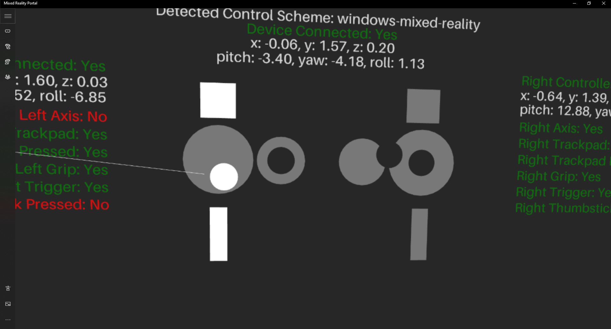

# Directions For Use: #
The Compatibility Tool allows for the testing of different HMDs and their respsective controllers. The tool tests positional and rotational data from the headset and controllers along with the controller buttons.

## Using the Tool
Open a compatible browser on the desired headset and hit the ***VR*** button.  The device connected is automatically detected and the controller layout is displayed if controllers are found. As inputs are recieved from the controllers, the corresponding textboxes will be converted to green. A json file can be produced that will indicate what buttons were pressed.

