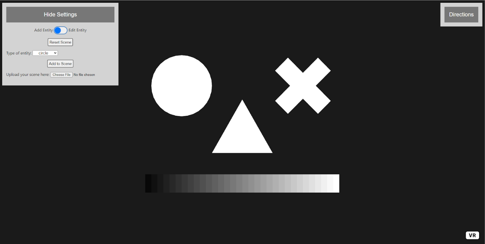

# WebXR Tools
This page contains a few tools and concepts for the use of WebVR in regulatory science.

The two notable tools are the [Custom Pattern Creator tool](./Custom) and the [TCA Test tool](./TCA)

The other two tools provided were proof of concepts and can be used as models for anyone wishing to do something similar.

## Custom Pattern Creator

## TCA Test

