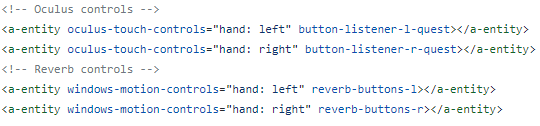
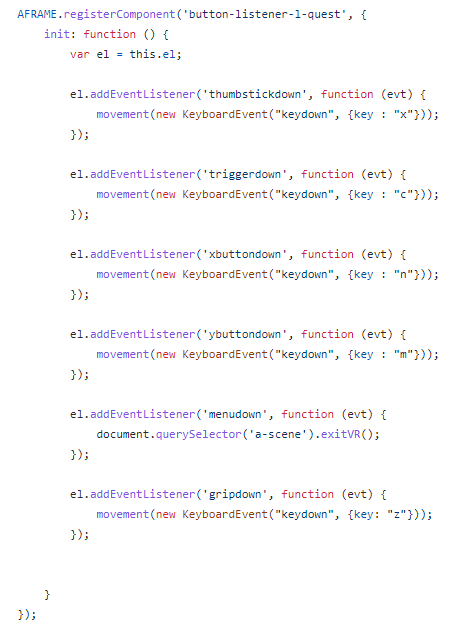
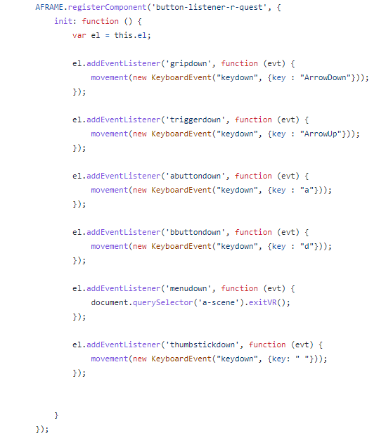

# TCA Test Instructions

## Setup
You can move the centering and change the offset of the bars from the center point while in VR mode also.  
In addition, you can control the size of the step for these. The step starts at 1 degree by default and can be changed by +- 0.1 degree.
It is universal, so changing the step when in centering mode will also change the step size when in offset mode. This is all done on the left controller.

Once you have found a good centering and offset, I recommend pressing the menu button on the left controller to exit VR mode and jotting these values down. These values will be stored in the center and offset text boxes. You can input these values when you open the website so you don't need to redo the centering/offset everytime.

## Moving Bars
The program allows you to control the red, green, or blue segments in both of the two bars. **You can only move one segment of a single bar at a time**. This is done with the right controller.

## Controls

### Keyboard
- a: Move current segment left
- d: Move current segment right
- Arrow up: Swap current segment to be one above (Red -> Red; Green -> Red; Blue -> Green)
- Arrow down: Swap current segment to be one below (Red -> Green; Green -> Blue; Blue -> Blue)
- t: Swap between left and right bar (default: right)
- n: Move centering left/increase offset
- m: Move centering right/decrease offset
- x: Swap between centering and offset mode (default: centering)
- c: Increase step
- z: Decrease step
- Space: Show/hide centering dot
- esc: Exit immersive mode

### Controllers
**Currently, the only controllers that are supported are the Oculus Rift, Rift S, Oculus Quest 1 and 2.** If you would like to add new controllers, [check here to see if the controllers are supported.](https://aframe.io/docs/1.3.0/introduction/interactions-and-controllers.html) If the controllers are supported replace the following code with whatever controller you would like to use. **Make sure to take note of what buttons are available on this controller.** 

***Note: Some controllers have different button layouts which may result in needing to rebind controls. This can be done by adding in button listeners like the one below tailored to the new constraints. Each action on the controller is mapped to a key on the keyboard, so to change the button mapping for controllers, replace which key event is created on a button press.***

#### Left Controller Bindings

#### Right Controller Bindings

#### Right Controller: 
- a: Move current segment left
- b: Move current segment right
- trigger: Swap current segment to be one above
- grip: Swap current segment to the one below
- Press in thumbstick: Hide center dot

#### Left Controller:
- x: Move centering left/increase offset
- y: Move centering right/decrease offset
- trigger: Increase step
- grip: Decrease step
- Press in thumbstick: Swap between centering and offset
- menu: Exit VR
