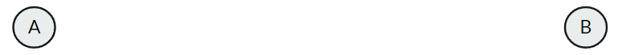
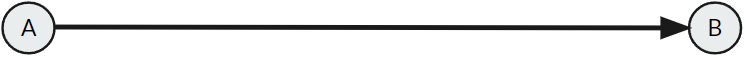
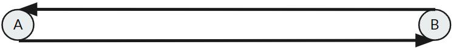

Animation
================

Pause
-------------------
Used to provide a pause between the executions of animations.

.. image:: ../Images/pause.PNG
        :width: 600

+-----------------------------------+---------------------------------------------------+--------------------------------------+
| **Attribute**                     |  **Description**                                  |  **Default Value**                   |
+-----------------------------------+---------------------------------------------------+--------------------------------------+
| Time (sec)                        | Duration of pause                                 | (0 m, 0 m, 250 deg)                  |
+-----------------------------------+---------------------------------------------------+--------------------------------------+

Discontinuous
-------------------
Teleports an entity between two points after a duration of time has passed.

+-----------------------------------+---------------------------------------------------+--------------------------------------+
| **Attribute**                     |  **Description**                                  |  **Default Value**                   |
+-----------------------------------+---------------------------------------------------+--------------------------------------+
| Start Point                       | The starting point of the animation               | (0 m, 0 m, 250 deg)                  |
+-----------------------------------+---------------------------------------------------+--------------------------------------+
| End Point                         | The ending point of the animation                 | (0 m, 0 m, 250 deg)                  |
+-----------------------------------+---------------------------------------------------+--------------------------------------+
| Time (sec)                        | Duration before teleport                          | (0 m, 0 m, 250 deg)                  |
+-----------------------------------+---------------------------------------------------+--------------------------------------+

Start to finish
-------------------
Moves an entity on a set path from one point to another.

+-----------------------------------+---------------------------------------------------+--------------------------------------+
| **Attribute**                     |  **Description**                                  |  **Default Value**                   |
+-----------------------------------+---------------------------------------------------+--------------------------------------+
| Start Point                       | The starting point of the animation               | (0 m, 0 m, 250 deg)                  |
+-----------------------------------+---------------------------------------------------+--------------------------------------+
| End Point                         | The ending point of the animation                 | (0 m, 0 m, 250 deg)                  |
+-----------------------------------+---------------------------------------------------+--------------------------------------+
| Speed (m/s)                       | Initial velocity of the entity                    | 0                                    |
+-----------------------------------+---------------------------------------------------+--------------------------------------+
| Acceleration (m:sup:`2`/s)        | Acceleration of the entity                        | 0                                    |
+-----------------------------------+---------------------------------------------------+--------------------------------------+

Rubberband
-------------------
Moves an entity on a set path between two points.

+-----------------------------------+---------------------------------------------------+--------------------------------------+
| **Attribute**                     |  **Description**                                  |  **Default Value**                   |
+-----------------------------------+---------------------------------------------------+--------------------------------------+
| Start Point                       | The starting point of the animation               | (0 m, 0 m, 250 deg)                  |
+-----------------------------------+---------------------------------------------------+--------------------------------------+
| End Point                         | The ending point of the animation                 | (0 m, 0 m, 250 deg)                  |
+-----------------------------------+---------------------------------------------------+--------------------------------------+
| Speed (m/s)                       | Initial velocity of the entity                    | 0                                    |
+-----------------------------------+---------------------------------------------------+--------------------------------------+
| Acceleration (m:sup:`2`/s)        | Acceleration of the entity                        | 0                                    |
+-----------------------------------+---------------------------------------------------+--------------------------------------+

Notes
-----------------
- Swapping to advanced mode will convert the start and end points to cartesian coordinates
- When in advanced mode, the entity will not automatically rotate itself to face the camera during movement